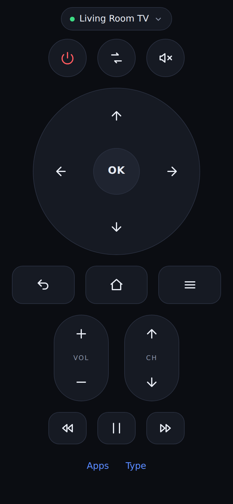

# TV Remote

Lost the remote. Control the TV from your phone's browser instead.



## Why it works this way

Phones don't have IR blasters, so nothing on your phone can pretend to be the
original remote. What smart TVs *do* have is a network control API. So:

```
your phone  ──HTTP──>  this server        ──TV's own protocol──>  your TV
(any browser)          (laptop / Pi on the same WiFi)
```

You run the server on any always-on-ish machine on your network — a laptop is
fine — and open a web page on your phone. No app store, no account, nothing
leaves your network.

## Setup

Requires Node 18 or newer.

```bash
git clone <this repo>
cd tv-remote
bash install.sh
```

That checks Node, installs dependencies and starts the server. Add
`--service` to also register it as an autostart service (systemd on Linux,
launchd on macOS) so it survives reboots.

It prints a URL and a QR code:

```
  On your phone:    http://192.168.1.20:8477

  ▄▄▄▄▄▄▄▄▄▄▄▄▄▄▄▄▄▄▄▄▄▄▄▄▄▄▄
  █ ▄▄▄▄▄ █▄▀▀▄▄▀▀█▄█ ▄▄▄▄▄ █
  ...
```

**Point your phone camera at the QR code** — it opens the remote. No typing IP
addresses. The page finds your TV automatically the first time.

If you'd rather do it by hand: `npm install && npm start`.

### On an iPhone

Open that `http://192.168.x.x:8477` URL in Safari, then **Share → Add to Home
Screen**. It launches fullscreen with no address bar, so it behaves like a real
remote app.

Two iOS things worth knowing:

- **No haptics.** Safari has no Vibration API, so presses can't buzz. The button
  flashes blue instead — that's your press confirmation.
- **The server still needs a computer.** A Mac, PC or Raspberry Pi on the same
  WiFi has to be running `npm start`. An iPhone alone can't do it; iOS won't let
  Safari open the raw network connections the TV protocols need. A Raspberry Pi
  Zero left plugged in behind the TV is the usual fix.

Add to Home Screen is per-browser: it must be Safari, not Chrome on iOS.

### Keeping it running

Leaving a terminal open forever isn't much of a plan. [DEPLOY.md](DEPLOY.md)
covers running it as a background service (systemd, launchd or Docker), and how
to reach it from outside the house with Tailscale.

It also explains why GitHub Pages and other static hosts can't run this — short
version: controlling a device on your LAN requires code running on your LAN.

## Supported TVs

| Brand | How it connects | What pairing looks like |
|---|---|---|
| **Roku** (incl. Roku-branded TCL/Hisense/Onn) | ECP on port 8060 | None — works immediately |
| **Samsung** (2016+, Tizen) | WebSocket on 8002 | TV shows *Allow this device?* — accept it |
| **LG** (2014+, webOS) | WebSocket on 3001 | TV shows a prompt — accept it |
| **Vizio** SmartCast | HTTPS on 7345 | TV shows a 4-digit PIN — type it in |
| **Sony** Bravia | IRCC over HTTP | You set a Pre-Shared Key on the TV first |

Pairing happens once. Tokens are stored in `~/.tv-remote/devices.json`
(mode 0600) so the TV stops asking.

### Sony: setting the pre-shared key

On the TV: **Settings → Network → Home Network Setup → IP Control**. Set
*Authentication* to "Normal and Pre-Shared Key", pick any key you like, then
enter that same key in the app when it asks.

### Not supported

**Android TV / Google TV** (Sony's newer sets, Chromecast with Google TV, most
Philips/Sharp) uses a protocol that needs a TLS client certificate negotiated
through an on-screen pairing code. It's a bigger job than the rest and isn't
implemented — [`androidtv-remote`](https://github.com/louis49/androidtv-remote)
is the reference if you want to add it. **Fire TV** would need ADB. Pre-2016
Samsungs speak a different, older protocol.

## Using it

Everything is where you'd expect. A few things that aren't obvious:

- **Press and hold** volume, channel and the arrows to repeat, like a real remote.
- **Apps** (Roku only) launches Netflix, YouTube etc. directly.
- **Type** (Roku only) sends real text, so you don't have to peck out a search
  query with the D-pad.
- Buttons your TV brand can't do are greyed out rather than failing on press.
  Vizio has no HOME, for instance — use **input** to reach the SmartCast hub.
- The tab responds to a physical keyboard too: arrows, Enter, Escape, `+`/`-`,
  `m`, space.

### Power on

Turning a TV *off* always works. Turning one back *on* often doesn't — most TVs
drop off the network when they sleep, so there's nothing left to send a command
to. Roku and Samsung generally wake; LG needs Wake-on-LAN enabled
(*Settings → General → Mobile TV On*) which this doesn't send yet.

## If it can't find your TV

1. **Same network?** Phone, server and TV all on the same WiFi. Guest networks
   and "AP isolation" on the router will silently block this.
2. **Add it by IP.** Discovery uses SSDP plus a subnet sweep, and some routers
   block the multicast SSDP relies on. Get the TV's IP from
   *Settings → Network → Status* on the TV, then use **Add by IP address**.
3. **Check the TV's setting.** Roku: *Settings → System → Advanced → Control by
   mobile apps* must be Enabled. Samsung: *General → External Device Manager →
   Device Connection Manager*. Vizio/Sony need the steps above.
4. **Wider than a /24?** The sweep only scans /24 and smaller. Add by IP.

Command-line scan, useful for checking whether the problem is the network or the
browser:

```bash
npm run scan
```

## Security

By default there's no authentication. Anyone who can reach the port can control
your TV — on a home network that's the same set of people who could pick up the
real remote, which is why it's the default.

Set a PIN if the remote will be reachable beyond your own LAN (a VPN, a tunnel,
a shared flat, an office):

```bash
TV_REMOTE_PIN=428913 npm start
```

The page asks for it once and remembers it. API calls without a valid PIN get a
401; the page itself still loads, since otherwise there'd be nowhere to type it.
Comparison is constant-time.

A PIN makes a tunnel reasonable. It is still not a reason to port-forward this
to the open internet — use Tailscale, see [DEPLOY.md](DEPLOY.md).

Pairing tokens are stored locally and never sent to the browser. TV control
traffic skips certificate verification, because Samsung and Vizio ship
self-signed certs with no way to install a CA; that's scoped to TV requests
only, not the whole process.

## Development

```bash
npm test     # smoke tests against a mock Roku — no hardware needed
npm start    # PORT=... to change the port
```

Adding a brand means one file in `server/adapters/` exporting `probe`,
`sendKey`, `supportedKeys` and optionally `pair`. Register it in
`server/adapters/index.js`; the UI adapts on its own from what the adapter
declares.

The key vocabulary the UI speaks is in `server/keys.js` — adapters translate it
into whatever their TV actually wants.

## License

MIT
